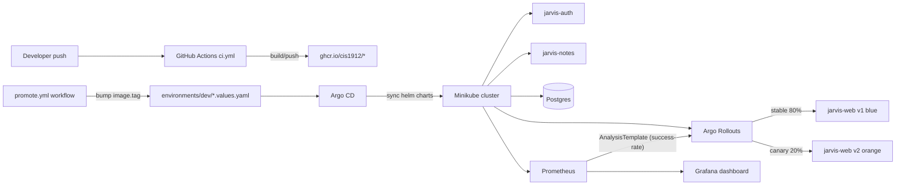

# Jarvis GitOps Canary Pipeline

> CIS 1912 (DevOps) — Final Project — Spring 2026
> Steven Chang, Grace Li, Logan Brassington, Sohum Trivedi

A GitOps-driven progressive-delivery pipeline for the Jarvis microservices.
Two color-themed builds of a small web service are rolled out via **Argo
Rollouts** with a Prometheus-backed analysis step; if the new version's
error rate exceeds a threshold, Argo Rollouts **automatically rolls back**.

The visible demo: refresh `http://jarvis-web.local` during a canary and watch
the page color flip between blue (stable v1) and orange (canary v2). Push a
deliberately-broken v3 and watch traffic shift back to v1 without anyone
touching the cluster.

## What this hits from class

| Class topic | Where it lives |
| --- | --- |
| Docker | `app/jarvis-web/Dockerfile`, `app/jarvis-backend/services/*/Dockerfile` |
| Docker Compose | `compose.yaml` (full local-dev stack with both web variants) |
| Kubernetes / Helm | `charts/{jarvis-web,jarvis-auth,jarvis-notes,jarvis-platform}` |
| Reproducibility / GitOps | `gitops/apps/`, `environments/dev/*.values.yaml` (single source of truth) |
| Progressive delivery + safe CD | `charts/jarvis-web/templates/rollout.yaml`, `analysis-template.yaml` |
| CI/CD with GitHub Actions | `.github/workflows/{ci,promote}.yml` |
| Observability | kube-prometheus-stack + `monitoring/dashboards/jarvis-canary.json` |
| Infrastructure as Code | `infra/terraform/` (EKS + ECR + VPC) |

## Architecture



## Prerequisites

- macOS or Linux
- Docker Desktop (running)
- `minikube`, `kubectl`, `helm`, `terraform` (Homebrew: `brew install minikube kubectl helm terraform`)
- Optional: `kubectl argo rollouts` plugin (`brew install argoproj/tap/kubectl-argo-rollouts`) — used by the demo scripts to render the rollout tree

## Quick start (local demo)

```bash
# 1. one-time cluster setup (~5 minutes the first time)
./scripts/bootstrap.sh

# 2. deploy all the apps
./scripts/install-helm.sh

# 3. open the page (your /etc/hosts was wired up by bootstrap.sh)
open http://jarvis-web.local
# you should see a solid-blue page reading "Jarvis v1.0.0"

# 4. happy-path canary: v1 -> v2 (blue -> orange)
./scripts/demo-canary-success.sh
# refresh the page repeatedly during the rollout and watch it flip colors

# 5. failure-path: v3 is intentionally broken (returns 5xx)
./scripts/demo-canary-rollback.sh
# watch Argo Rollouts auto-rollback when the AnalysisTemplate trips
```

## Demo walkthrough (for the presentation)

1. **Show the values file.** `environments/dev/jarvis-web.values.yaml` is the
   single source of truth for what's running. Image tag, theme color, replica
   count — all live here.
2. **Show a clean cluster.** `kubectl -n jarvis get rollout,svc,ingress`.
   Open `http://jarvis-web.local` → solid blue.
3. **Promote to v2.** Run `./scripts/demo-canary-success.sh`. The script edits
   the values file and `helm upgrade`s — equivalent to what merging a PR
   would do under full GitOps. The rollout tree appears in the terminal.
4. **Refresh the browser repeatedly** while the canary is at 20% / 50% / 80%.
   Roughly that fraction of refreshes serve the orange v2 page; the rest stay
   blue. Pods can be inspected with `kubectl -n jarvis get pods -L app.kubernetes.io/version`.
5. **Watch analysis pass** at each step. The `success-rate` AnalysisTemplate
   queries Prometheus and gates promotion.
6. **Now promote a broken version.** Run `./scripts/demo-canary-rollback.sh`.
   v3 has `FAIL_MODE=true` so every request to `/` returns 500.
7. **Argo Rollouts pauses at 20%, runs analysis, fails it.** The Rollout
   automatically aborts: traffic returns to the stable revision (which is now
   v2). No human intervention. `kubectl argo rollouts get rollout jarvis-web-jarvis-web -n jarvis`.
8. **Show the Grafana dashboard.** Port-forward Grafana
   (`kubectl -n monitoring port-forward svc/kube-prometheus-stack-grafana 3000:80`),
   open the "Jarvis Canary" dashboard, point at the spike + recovery.
9. **Show the Terraform.** `cd infra/terraform && terraform plan`. Same
   architecture would deploy to AWS (EKS + ECR + VPC) without changing any
   chart code.

## Repo layout

```
.
├── app/
│   ├── jarvis-web/              # canary-target FastAPI service (THEME_COLOR/FAIL_MODE)
│   │   ├── app/main.py
│   │   ├── tests/test_main.py
│   │   ├── Dockerfile
│   │   └── requirements.txt
│   └── jarvis-backend/          # vendored from cis1912-sp26/jarvis-monorepo
│       ├── services/auth/       # FastAPI auth service (port 8000)
│       ├── services/notes/      # FastAPI notes service (port 8001)
│       └── utilities/           # shared models / pydantic schemas
├── charts/
│   ├── jarvis-web/              # uses Argo Rollouts Rollout + AnalysisTemplate
│   │   └── templates/{rollout,service,ingress,servicemonitor,analysis-template}.yaml
│   ├── jarvis-auth/
│   ├── jarvis-notes/
│   └── jarvis-platform/         # umbrella for postgresql + kube-prometheus-stack
├── environments/dev/            # per-env values files (CI bumps image.tag here)
├── gitops/
│   ├── apps/                    # Argo CD Application CRs (App-of-Apps)
│   └── bootstrap/
├── infra/terraform/             # EKS + ECR + VPC for the AWS deploy target
├── monitoring/dashboards/       # Grafana dashboard JSON (auto-loaded by sidecar)
├── scripts/
│   ├── bootstrap.sh             # one-time cluster setup
│   ├── install-helm.sh          # deploy apps via Helm directly
│   ├── install-argocd.sh        # deploy apps via Argo CD GitOps (needs git remote)
│   ├── demo-canary-success.sh   # v1 -> v2 happy path
│   ├── demo-canary-rollback.sh  # v3 broken -> auto rollback
│   └── teardown.sh              # minikube delete
├── compose.yaml                 # full local-dev stack (no k8s required)
└── .github/workflows/
    ├── ci.yml                   # lint, test, build/push images
    └── promote.yml              # bump environments/dev/*.values.yaml via PR
```

## Why a small `jarvis-web` instead of canarying the Next.js frontend?

The Next.js app from the Jarvis monorepo is heavy (long build, lots of moving
parts) and the visual difference between two builds isn't dramatic. A tiny
~80-line FastAPI service that renders one HTML page from env vars is:

- **Tiny** — CI loop under a minute.
- **Visually obvious** — refresh the browser, see a different color.
- **Naturally observable** — `/metrics` is wired up out of the box, so the
  AnalysisTemplate's PromQL "just works".
- **Easy to deliberately break** — `FAIL_MODE=true` flips it from healthy v2
  to broken v3 with the same image.

The vendored Jarvis services (`auth`, `notes`) are still fully containerized,
Helm-charted, and GitOps-managed — they prove the pipeline handles real
microservices. The canary visual just rides on `jarvis-web` for clarity.

## Troubleshooting

| Symptom | Fix |
| --- | --- |
| `bootstrap.sh` fails on `docker info` | Start Docker Desktop first |
| `jarvis-web.local` not resolving | `bootstrap.sh` writes to `/etc/hosts`; check the entry exists with `grep jarvis-web /etc/hosts` |
| Rollout stuck at "Progressing" forever | `kubectl -n jarvis describe rollout jarvis-web-jarvis-web` — usually a missing image; re-run image load |
| AnalysisRun has no data | Prometheus needs ~30s to scrape; the analysis step has `count: 4` × `interval: 15s` to give it time |
| `kubectl argo rollouts` not found | `brew install argoproj/tap/kubectl-argo-rollouts` (the demo scripts use it for nicer output) |

## Cleanup

```bash
./scripts/teardown.sh        # nukes the minikube cluster
docker rmi jarvis-web:v1.0.0 jarvis-web:v2.0.0 jarvis-web:v3.0.0-broken \
           jarvis-auth:latest jarvis-notes:latest 2>/dev/null || true
```
