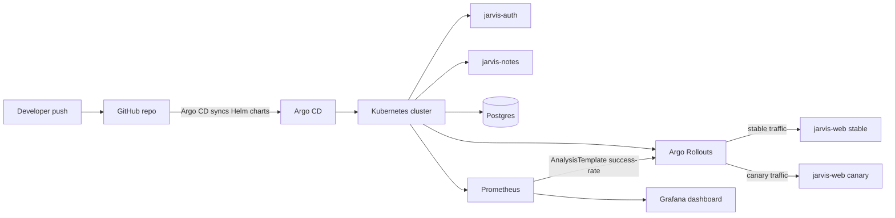

# Jarvis GitOps Canary Pipeline

> CIS 1912 (DevOps) — Final Project — Spring 2026  
> Steven Chang, Grace Li, Logan Brassington, Sohum Trivedi

A GitOps-driven progressive-delivery pipeline for the Jarvis microservices.
A small color-themed web service is rolled out via **Argo Rollouts** with a
Prometheus-backed analysis step; if the canary's user-facing error rate exceeds
the threshold, Argo Rollouts **automatically aborts/rolls back traffic** to the
previous stable ReplicaSet.

There are two demo paths:

- **Local Minikube demo:** scripts and `environments/dev/*.values.yaml` still
  support the original local workflow at `http://jarvis-web.local`.
- **AWS GitOps demo:** the current live demoware path is values-driven GitOps on
  EKS. Commit changes to `environments/aws/jarvis-web.values.yaml`; Argo CD
  syncs them, and Argo Rollouts performs the canary.

Live AWS app URL:

```text
http://aa180030810ff47df9c684a09112c3fc-c8482971d4afdc73.elb.us-east-1.amazonaws.com
```

During a canary, repeated refreshes should show a mix of stable and canary
colors. That is expected: the rollout sends 20%, then 50%, then 80%, and then
100% of traffic to the new version if Prometheus analysis passes.

## What this hits from class

| Class topic | Where it lives |
| --- | --- |
| Docker | `app/jarvis-web/Dockerfile`, `app/jarvis-backend/services/*/Dockerfile` |
| Docker Compose | `compose.yaml` local-dev stack |
| Kubernetes / Helm | `charts/{jarvis-web,jarvis-auth,jarvis-notes,jarvis-platform}` |
| Reproducibility / GitOps | `gitops/apps/`, `environments/dev/*.values.yaml`, `environments/aws/*.values.yaml` |
| Progressive delivery + safe CD | `charts/jarvis-web/templates/rollout.yaml`, `analysis-template.yaml` |
| CI/CD with GitHub Actions | `.github/workflows/{ci,promote}.yml` — currently focused on GHCR/dev; AWS demo uses manual values commits |
| Observability | kube-prometheus-stack + `monitoring/dashboards/jarvis-canary.json` |
| Infrastructure as Code | `infra/terraform/` — EKS + ECR + VPC |

## Architecture



AWS demo details:

| Item | Value |
| --- | --- |
| AWS account | `733717814278` |
| Region | `us-east-1` |
| EKS cluster | `jarvis` |
| App namespace | `jarvis` |
| Monitoring namespace | `monitoring` |
| Argo CD namespace | `argocd` |
| Public app URL | `http://aa180030810ff47df9c684a09112c3fc-c8482971d4afdc73.elb.us-east-1.amazonaws.com` |
| GitOps repo URL | `https://github.com/logbrass/dev_ops.git` |

## Prerequisites

Local demo:

- macOS or Linux
- Docker Desktop running
- `minikube`, `kubectl`, `helm`, `terraform`
- Optional: `kubectl argo rollouts` plugin

AWS demo:

- AWS access to account `733717814278`
- `aws`, `kubectl`, `helm`
- Optional: `kubectl argo rollouts` plugin
- Runtime secrets created out-of-band with `./scripts/create-aws-secrets.sh`

## Quick start: AWS GitOps demo

The AWS cluster already exists. Do not destroy or recreate it for the demo.

```bash
aws eks --region us-east-1 update-kubeconfig --name jarvis
kubectl get nodes
kubectl -n argocd get applications
kubectl -n jarvis get rollout,pods,svc,ingress
kubectl -n monitoring get pods
kubectl -n monitoring get secret jarvis-postgres-secret
kubectl -n jarvis get secret jarvis-auth-secret jarvis-notes-secret
```

Expected Argo CD apps:

```text
jarvis-root
jarvis-platform
jarvis-auth
jarvis-notes
jarvis-web
```

If the child apps are missing, bootstrap the App-of-Apps:

```bash
kubectl apply -f gitops/apps/root.yaml
kubectl -n argocd get applications
```

The repo is public at the time of this demo. If it is made private again, Argo
CD will need repository credentials configured out-of-band; do not commit
GitHub tokens or SSH keys.

### AWS rollout targets

Change only `environments/aws/jarvis-web.values.yaml` for the lightweight demo.

| Demo state | `image.tag` | `theme.color` | `theme.name` | `failMode` |
| --- | --- | --- | --- | --- |
| Baseline/stable | `v1.0.0` | `#1f6feb` | `blue` | `false` |
| Successful canary | `v2.0.0` | `#f97316` | `orange` | `false` |
| Broken canary | `v3.0.0-broken` | `#dc2626` | `red` | `true` |

Commit and push a values change, then watch:

```bash
kubectl -n argocd get application jarvis-web
kubectl -n jarvis get rollout jarvis-web-jarvis-web -w
# or, if installed:
kubectl argo rollouts get rollout jarvis-web-jarvis-web -n jarvis --watch
```

Generate traffic during the broken rollout so Prometheus has request data:

```bash
LB=aa180030810ff47df9c684a09112c3fc-c8482971d4afdc73.elb.us-east-1.amazonaws.com
while true; do
  curl -s "http://$LB/" > /dev/null
  sleep 0.5
done
```

For the full operator script, see `DEMO_RUNBOOK.md`.

## Quick start: local demo

```bash
# 1. one-time cluster setup (~5 minutes the first time)
./scripts/bootstrap.sh

# 2. deploy all the apps
./scripts/install-helm.sh

# 3. open the page (your /etc/hosts was wired up by bootstrap.sh)
open http://jarvis-web.local
# you should see a solid-blue page reading "Jarvis v1.0.0"

# 4. happy-path canary: v1 -> v2 (blue -> orange)
./scripts/demo-canary-success.sh
# refresh the page repeatedly during the rollout and watch it flip colors

# 5. failure-path: v3 is intentionally broken (returns 5xx on /)
./scripts/demo-canary-rollback.sh
# watch Argo Rollouts auto-rollback when the AnalysisTemplate trips
```

## Demo walkthrough: AWS

1. **Show the AWS values file.** `environments/aws/jarvis-web.values.yaml` is
   the source of truth for the AWS demo's image tag, theme, and `failMode`.
2. **Show Argo CD is managing the app.** `kubectl -n argocd get applications`
   should show `jarvis-web` as `Synced` / `Healthy`.
3. **Show the baseline.** Open the public ELB URL and/or `curl /version`.
4. **Promote to v2.** Commit `v2.0.0`, orange, `failMode=false`.
5. **Watch traffic split.** At 20%, most refreshes still show blue and some
   show orange. That is the intended canary behavior.
6. **Watch analysis pass.** The `success-rate` AnalysisTemplate queries
   Prometheus for `http_requests_total` on the stable/canary ServiceMonitor
   jobs and filters to user traffic on `handler="/"`.
7. **Promote a broken v3.** Commit `v3.0.0-broken`, red, `failMode=true`, and
   keep the traffic loop running.
8. **Watch analysis fail and abort.** The red canary returns HTTP 500 for `/`.
   Argo Rollouts aborts and keeps traffic on the prior stable ReplicaSet.
9. **Reset Git.** Rollouts protects traffic but does not revert Git. Push a
   corrective commit back to `v2.0.0` orange or `v1.0.0` blue.

## Repo layout

```
.
├── app/
│   ├── jarvis-web/              # canary-target FastAPI service (THEME_COLOR/FAIL_MODE)
│   └── jarvis-backend/          # auth + notes services and shared utilities
├── charts/
│   ├── jarvis-web/              # Argo Rollouts Rollout + AnalysisTemplate
│   ├── jarvis-auth/
│   ├── jarvis-notes/
│   └── jarvis-platform/         # postgresql + kube-prometheus-stack
├── environments/
│   ├── dev/                     # local/dev values files
│   └── aws/                     # AWS values files used by Argo CD demo
├── gitops/
│   ├── apps/                    # Argo CD Application CRs (App-of-Apps)
│   └── bootstrap/               # controller bootstrap notes/manifests
├── infra/terraform/             # EKS + ECR + VPC for AWS
├── monitoring/dashboards/       # Grafana dashboard JSON
├── scripts/                     # bootstrap, install, secrets, and demo helpers
├── DEMO_RUNBOOK.md              # AWS canary demo runbook
├── compose.yaml                 # local-dev stack
└── .github/workflows/           # CI/promote workflows
```

## Why a small `jarvis-web` instead of canarying the Next.js frontend?

The Next.js app from the Jarvis monorepo is heavy: long build, many moving
parts, and visual differences between builds are not dramatic. A tiny FastAPI
service that renders one HTML page from env vars is:

- **Tiny** — fast build/test loop.
- **Visually obvious** — refresh the browser and see a different color.
- **Naturally observable** — `/metrics` is wired up, so the AnalysisTemplate's
  PromQL can gate rollout promotion.
- **Easy to deliberately break** — `FAIL_MODE=true` makes `/` return HTTP 500
  while readiness/liveness stay green, letting Prometheus observe canary 5xxs.

The vendored Jarvis services (`auth`, `notes`) are still containerized,
Helm-charted, and GitOps-managed. The canary visual rides on `jarvis-web` for
clarity.

## Troubleshooting

| Symptom | Fix |
| --- | --- |
| `bootstrap.sh` fails on `docker info` | Start Docker Desktop first |
| `jarvis-web.local` not resolving | `bootstrap.sh` writes to `/etc/hosts`; check `grep jarvis-web /etc/hosts` |
| AWS URL still shows v1 after v2 commit | During canary this is expected. Refresh repeatedly or sample `/version`; traffic starts at 20% canary. Also check `kubectl -n jarvis get rollout jarvis-web-jarvis-web` |
| Argo CD apps missing | `kubectl apply -f gitops/apps/root.yaml` |
| Argo CD says `authentication required` | The repo is private or credentials are missing. Add Argo CD repo credentials out-of-band; do not commit tokens |
| Rollout stuck at `Progressing` forever | `kubectl -n jarvis describe rollout jarvis-web-jarvis-web`; usually missing image, failing readiness, or analysis waiting for data |
| AnalysisRun has no data | Generate traffic and wait for Prometheus to scrape; use the queries in `DEMO_RUNBOOK.md` |
| `kubectl argo rollouts` not found | `brew install argoproj/tap/kubectl-argo-rollouts`; plain `kubectl -n jarvis get rollout ... -w` also works |

## Cleanup

Local cleanup:

```bash
./scripts/teardown.sh        # deletes the minikube cluster
docker rmi jarvis-web:v1.0.0 jarvis-web:v2.0.0 jarvis-web:v3.0.0-broken \
           jarvis-auth:latest jarvis-notes:latest 2>/dev/null || true
```

AWS demo cleanup/reset is a corrective Git commit, not cluster deletion. After
the broken canary demo, commit the AWS values file back to `v2.0.0` orange or
`v1.0.0` blue.
